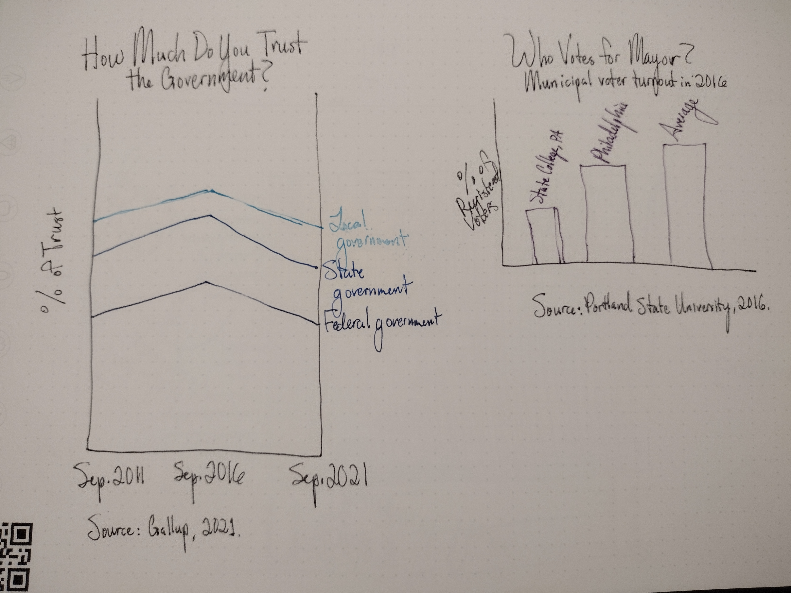
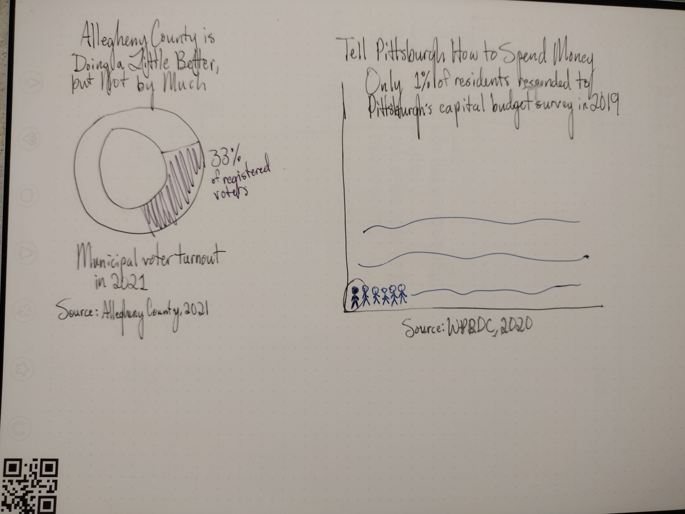
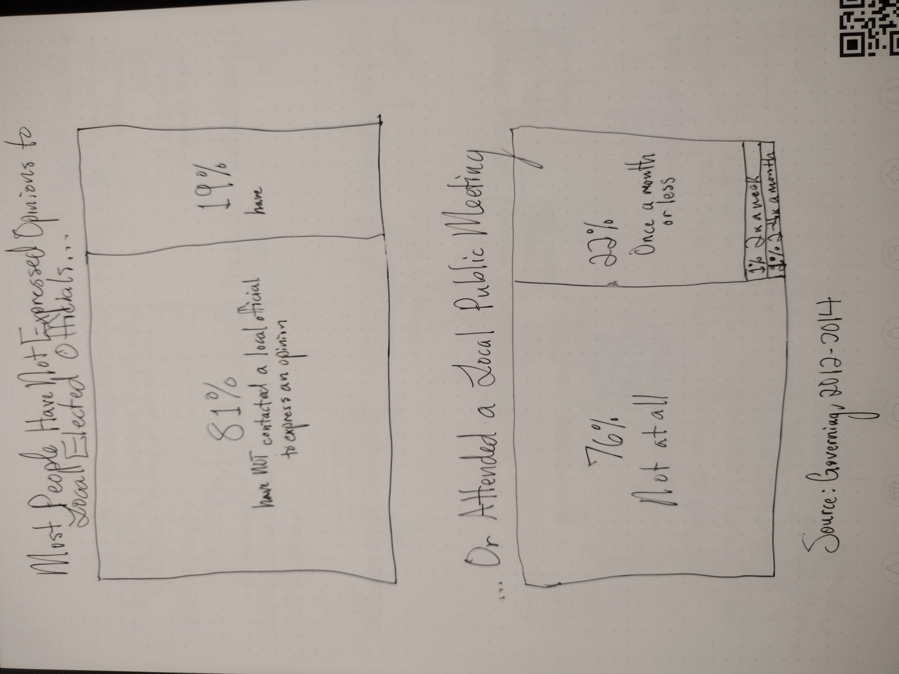

# Final Project
## Part One
### Project Summary
My final project is about civic participation and engagement in local government in Allegheny County. Using data from Allegheny County specifically, as well as national data, my goal is to illustrate the importance of engaging with local government, particularly as a means of rebuilding trust in the government. I work in local government, and many people are skeptical as to whether we as staff are doing a competent job. They have ideas of how their local government should be run, which is good. However, oftentimes they have not engaged meaningfully with their local government staff and elected officials before making suggestions. We are very transparent about how we use our time and their tax dollars, but people don't always know that information is out there. I want to empower people to work with their local government and figure out what it can do for them. I want people to have the trust and the tools they need to share ideas on how to improve the community. People don't always realize it, but local government officials and staff make decisions that directly impact their everyday lives, and most local governments want citizen input on how they can improve. Local government can empower meaningful community chanage, and my goal is to empower people to do that. 

### Project Structure
#### Setup
I will begin by discussing public trust in the US government at the federal, state, and local level. I won't dwell on it, but I will emphasize the lack of trust in the federal and even the state government before highlighting the fact that most people trust their local government. I will speak a bit to why that is and why polarization has not had as dramatic an impact on politics and policy at the local level. 

#### Conflict
I will then move on to discuss how much impact local government has on people's daily lives, probably more than people realize. It has the potential to impact people negatively, but it also has the potential to become a vehicle for change at the community level, which is an underutilized power. I will demonstrate how little people are actually paying attention to local government, citing data from the national level on poor municipal voter turnout levels and civic engagement levels, then narrowing in on similar data for Allegheny County. 

#### Resolution
My call to action will be to show case studies of local governments that are trying to engage their citizens in innovative ways, including the City of Pittsburgh and Allegheny County. I will illustrate that the government wants your opinion and is open to suggestions. 

### Initial Sketches

### Data Sources

- “Americans’ Trust in Government Remains Low.” Gallup.com, September 30, 2021. https://news.gallup.com/poll/355124/americans-trust-government-remains-low.aspx.
- Bureau, US Census. “Volunteering and Civic Life.” Census.gov. Accessed February 13, 2023. https://www.census.gov/data/datasets/time-series/demo/cps/cps-supp_cps-repwgt/cps-volunteer.html.
- “City of Pittsburgh Capital Budget Deliberative Forum Survey Responses - WPRDC.” Accessed February 13, 2023. https://data.wprdc.org/dataset/capital-budget-deliberative-forum-survey.
- “Election Night Reporting.” Accessed February 13, 2023. https://results.enr.clarityelections.com/PA/Allegheny/111176/web.285569/#/turnout.
- Governing. “The Citizens Most Vocal in Local Government,” June 11, 2014. https://www.governing.com/archive/gov-national-survey-shows-citizens-most-vocal-active-in-local-government.html.
- “Who Votes For Mayor? A Project of Portland State University and the Knight Foundation.” Accessed February 13, 2023. http://whovotesformayor.org/.

#### Trust in Government Data
- [Gallup Poll, "Americans Trust in Government Remains Low", 2021](https://news.gallup.com/poll/355124/americans-trust-government-remains-low.aspx)
This data documents historical trust in the government at the federal, state, and local levels from 1972 through 2021. It breaks down trust in the federal government into each branch, as well as handling of domestic vs. international issues. It is the most complete set of data I could find that shows trust in local government as a trend, not just as a snapshot.  

#### Voter Turnout Data
- [Portland State University, "Who Votes for Mayor?", 2016](http://whovotesformayor.org/)
This project from Portland State University documents voting in municipal elections in 50 cities across the United States. Though it does not include Pittsburgh specifically, it does include both Philadelphia and State College, Pennsylvania, which are useful points of comparison for Pittsburgh and Allegheny County. Additionally, as the data can be used to provide an average voter turnout for municipal elections across the 50 cities, it provides a useful point of contextual comparison for the aforementioned Pennsylvania cities as well as the data I obtained on municipal elections from Allegheny County. A downside of the data, however, is that it only provides a snapshot from 2016, not historical trend data.  

- [Allegheny County, PA, "November 2, 2021 Municipal Election Official Results", 2021](https://results.enr.clarityelections.com/PA/Allegheny/111176/web.285569/#/turnout)
Allegheny County provides comprehensive data on its municipal elections, so I obtained the data from the most recent municipal election in order to compare snapshot data from the above data source to a snapshot of data in Allegheny County. 

#### Civic Participation Data
- [Western Pennsylvania Regional Data Center, "City of Pittsburgh Capital Budget Deliberative Forum Survey Responses", 2019](https://data.wprdc.org/dataset/capital-budget-deliberative-forum-survey)
The WPRDC has comprehensive data, but it did not have too much on participation in government in Allegheny County. I am using the survey responses and their rate to approximate levels of local civic engagement in Allegheny County. 

- [Governing, "The Citizens Most Vocal in Local Government," 2014](https://www.governing.com/archive/gov-national-survey-shows-citizens-most-vocal-active-in-local-government.html#data)
Governing uses data from the National Research Center's National Citizen Survey. The National Research Center provides community survey services to local governments around the country, but much of that data is inaccessible. Moreover, since local governments have to pay for their services, not many local governments participate. However, this article provides a snapshot of their national findings that provides useful context for Allegheny County. 

- [US Census Bureau, "Volunteering and Civic Life," 2021](https://www.census.gov/data/datasets/time-series/demo/cps/cps-supp_cps-repwgt/cps-volunteer.html)
The US Census Bureau's American Community Survey has a supplement for volunteering and civic life. I have cleaned and sorted the data for Pennsylvania respondents from 2021 and calculated response rates for questions on public meeting attendance and contacting local government officials. 

Together, the data I have collected tells a story about local government in the United States. People trust it more than state and federal government but may participate in it to a lesser extent. My goal is to paint a picture of underutilized civic power and encourage people to exercise that power. I am also going to use case studies of cities across the United States asking for engagement and provide a call to action of how people can engage in Pittsburgh and Allegheny County. 

### Method and Medium
I intend to use Shorthand to build my final project. I will use Flourish and Tableau to create my data visualizations to embed in my final project on Shorthand. 
